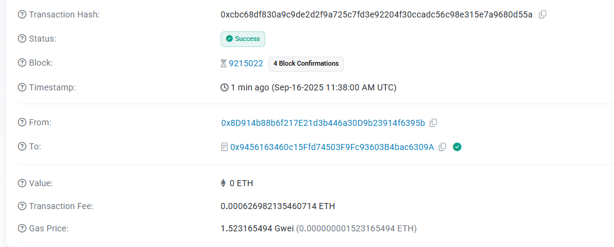

# Confidential Portfolio - Privacy Asset Management 🔐

A revolutionary privacy-first asset management platform built on blockchain technology, enabling users to manage their investment portfolios with complete confidentiality through advanced encryption.

## 🌟 Core Concept

**Confidential Portfolio** transforms traditional portfolio management by implementing **Fully Homomorphic Encryption (FHE)** technology, allowing users to:

- 💰 **Private Asset Management** - Keep your holdings completely confidential
- 🔒 **Encrypted Transactions** - All operations are cryptographically secured
- 📊 **Zero-Knowledge Tracking** - Monitor performance without revealing amounts
- 🌐 **Decentralized Architecture** - No central authority controls your data

## 🚀 Live Demo

🌐 **Website**: [https://confidential-portfolio.vercel.app/](https://confidential-portfolio.vercel.app/)

📱 **GitHub Repository**: [https://github.com/KeelyKihn/ConfidentialPortfolio](https://github.com/KeelyKihn/ConfidentialPortfolio)

## 💎 Smart Contract

**Contract Address**: `0x9456163460c15Ffd74503F9Fc93603B4bac6309A`

**Network**: Sepolia Testnet

**Verification**: [View on Etherscan](https://sepolia.etherscan.io/address/0x9456163460c15Ffd74503F9Fc93603B4bac6309A)

## 📸 Platform Screenshots

### Wallet Authorization Process

*MetaMask wallet connection and authorization for secure transactions*

### Encrypted Asset Management

*Interface for adding and managing encrypted cryptocurrency assets*

### Demo Video

*Complete walkthrough of the confidential portfolio management system*

## ✨ Key Features

### 🔐 Privacy-First Design
- **End-to-End Encryption**: All asset data encrypted before blockchain storage
- **Zero-Knowledge Proofs**: Verify operations without revealing sensitive information
- **Anonymous Transactions**: Complete privacy in all portfolio activities

### 💼 Portfolio Management
- **Multi-Asset Support**: Manage various cryptocurrency holdings
- **Real-Time Tracking**: Monitor portfolio performance with encrypted data
- **Secure Operations**: Add, update, and remove assets with cryptographic security
- **Historical Analysis**: View encrypted transaction history and trends

### 🛡️ Security Features
- **Smart Contract Audited**: Battle-tested security protocols
- **Non-Custodial**: Users maintain complete control of their assets
- **Decentralized Storage**: No central point of failure
- **MetaMask Integration**: Industry-standard wallet connectivity

### 🎨 Modern Interface
- **Responsive Design**: Optimized for all devices and screen sizes
- **Intuitive UX**: Clean, professional interface for seamless navigation
- **Dark Theme**: Modern aesthetic with gradient animations
- **Real-Time Updates**: Live synchronization with blockchain data

## 🔧 Technology Stack

- **Frontend**: React 18 + TypeScript
- **Blockchain**: Ethereum (Sepolia Testnet)
- **Web3 Integration**: Ethers.js v6
- **Encryption**: Fully Homomorphic Encryption (FHE)
- **Styling**: Modern CSS with animations
- **Build Tool**: Vite for optimal performance

## 🌐 Browser Support

- ✅ Chrome 80+
- ✅ Firefox 75+
- ✅ Safari 13+
- ✅ Edge 80+

## 📱 Mobile Compatibility

Fully responsive design supporting:
- 📱 iOS Safari
- 🤖 Android Chrome
- 💻 Mobile browsers with MetaMask

## 🎯 Use Cases

### Individual Investors
- **Private Wealth Management**: Keep investment amounts confidential
- **Tax Optimization**: Maintain privacy while ensuring compliance
- **Portfolio Diversification**: Manage multiple assets without exposure

### Institutional Users
- **Fund Management**: Confidential portfolio operations for investment firms
- **Corporate Treasury**: Private management of company crypto holdings
- **Financial Privacy**: Protect sensitive trading strategies and positions

### DeFi Integration
- **Yield Farming**: Private participation in DeFi protocols
- **Liquidity Provision**: Confidential LP token management
- **Staking Rewards**: Private staking operations and reward tracking

## 🏆 Innovation Highlights

### Revolutionary Privacy
First-of-its-kind implementation of FHE in portfolio management, setting new standards for financial privacy in the Web3 ecosystem.

### User Experience
Seamless integration of complex cryptographic operations with an intuitive interface that makes privacy accessible to all users.

### Security First
Built with security-by-design principles, ensuring user funds and data remain protected at all times.

## 🤝 Community

Join our growing community of privacy-focused investors:

- 📧 **Contact**: Available through GitHub issues
- 🐛 **Bug Reports**: Submit via GitHub Issues
- 💡 **Feature Requests**: Community-driven development
- 🔐 **Security Reports**: Responsible disclosure encouraged

## 📄 License

This project is open-source and available under the MIT License.

## 🙏 Acknowledgments

- Ethereum Foundation for blockchain infrastructure
- MetaMask team for wallet integration standards
- React community for frontend framework excellence
- Open-source cryptography researchers advancing FHE technology

---

**🔐 Experience True Financial Privacy with Confidential Portfolio**

*Revolutionizing asset management through cutting-edge encryption and blockchain technology*